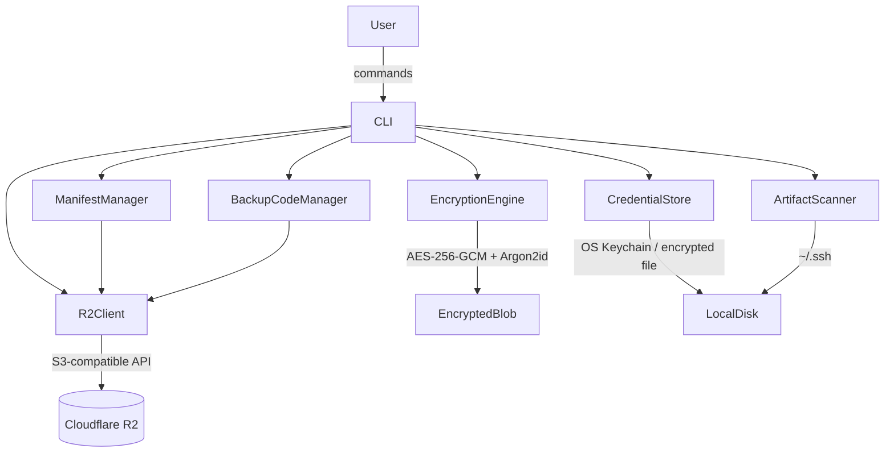
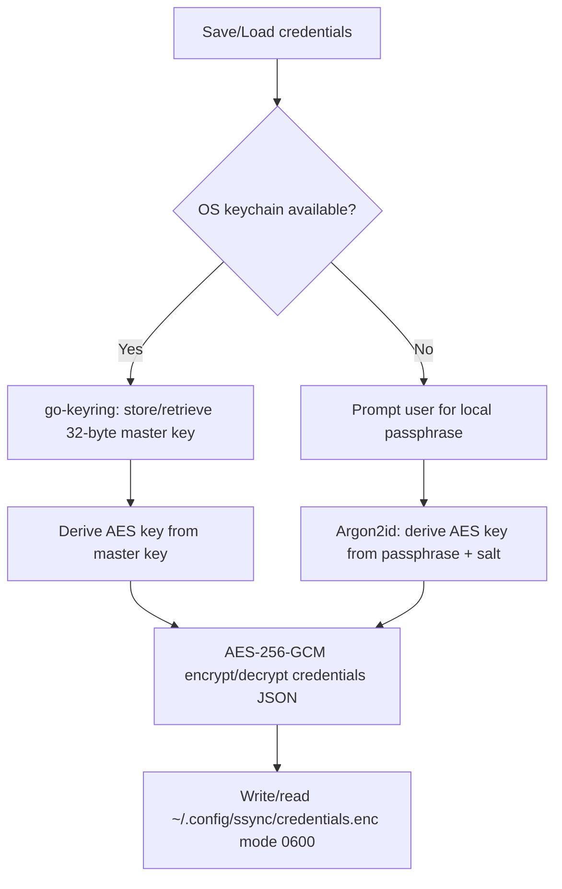

# Design Document: SSH Config Sync

## Overview

SSH Config Sync is a CLI tool that securely backs up and restores SSH artifacts (private keys, public keys, config, known_hosts) to Cloudflare R2 object storage. All artifacts are encrypted client-side with AES-256-GCM before leaving the machine. R2 credentials are stored locally in encrypted form. Backup codes provide a recovery path when the encryption password is lost.

The tool is implemented in **Go**, chosen for:
- Single static binary distribution (no runtime dependencies)
- Strong standard library for crypto primitives
- Excellent S3-compatible SDK support (`aws-sdk-go-v2`)
- Cross-platform OS keychain support via `zalando/go-keyring`
- Fast compile times and straightforward CLI tooling (`cobra`)

### Technology Stack

| Concern | Library / Approach |
|---|---|
| CLI framework | `github.com/spf13/cobra` |
| S3/R2 client | `github.com/aws/aws-sdk-go-v2` |
| Encryption | Go standard `crypto/aes`, `crypto/cipher` (AES-256-GCM) |
| KDF | `golang.org/x/crypto/argon2` (Argon2id) |
| OS keychain | `github.com/zalando/go-keyring` |
| Property-based tests | `github.com/leanovate/gopter` |
| JSON serialization | Go standard `encoding/json` |

---

## Architecture



### High-Level Flow: Upload

```
User runs `ssync push`
  → ArtifactScanner discovers ~/.ssh files
  → CLI presents list, user confirms selection
  → ManifestManager fetches remote manifest
  → CLI performs conflict detection per artifact
  → For each confirmed artifact:
      EncryptionEngine.Encrypt(plaintext, password) → EncryptedBlob
      R2Client.Upload(blob)
  → ManifestManager.Update(artifact metadata)
  → R2Client.Upload(manifest)
```

### High-Level Flow: Download

```
User runs `ssync pull`
  → CLI prompts for Encryption_Password
  → R2Client.Download(manifest)
  → For each artifact in manifest:
      R2Client.Download(encrypted blob)
      EncryptionEngine.Decrypt(blob, password) → plaintext
      Write plaintext to local path
```

---

## Components and Interfaces

### CLI (`cmd/`)

Entry point built with Cobra. Exposes the following commands:

| Command | Description |
|---|---|
| `configure` | Store R2 credentials (access key, secret, endpoint, bucket) |
| `push` | Encrypt and upload SSH artifacts to R2 |
| `pull` | Download and decrypt SSH artifacts from R2 |
| `recover` | Reset encryption password using a backup code |
| `regenerate-backup-codes` | Generate a new set of backup codes (requires current password) |

Global flags: `--ssh-dir <path>` (default `~/.ssh`), `--force` (skip conflict detection on push).

### EncryptionEngine (`internal/crypto/`)

```go
type EncryptionEngine interface {
    Encrypt(plaintext []byte, password string) (EncryptedBlob, error)
    Decrypt(blob EncryptedBlob, password string) ([]byte, error)
}
```

Responsibilities:
- Derive a 32-byte key from `password` + random salt using Argon2id
- Encrypt with AES-256-GCM using a random 12-byte nonce
- Produce a self-contained `EncryptedBlob` (see Data Models)
- Verify GCM authentication tag on decrypt; return error on failure

### CredentialStore (`internal/credentials/`)

```go
type CredentialStore interface {
    Save(creds R2Credentials) error
    Load() (R2Credentials, error)
}
```

Responsibilities:
- Serialize credentials to JSON
- Encrypt the JSON payload using a key from the OS keychain (via `go-keyring`) or a local passphrase if keychain is unavailable
- Write to `~/.config/ssync/credentials.enc` with mode 0600
- On load, check file permissions; refuse if broader than 0600
- Verify GCM authentication tag to detect tampering

### R2Client (`internal/r2/`)

```go
type R2Client interface {
    Upload(key string, data []byte) error
    Download(key string) ([]byte, error)
    List() ([]string, error)
    Delete(key string) error
}
```

Thin wrapper around `aws-sdk-go-v2/service/s3`. Translates S3 errors into domain errors. Reports partial failures per artifact.

### BackupCodeManager (`internal/backup/`)

```go
type BackupCodeManager interface {
    Generate() ([]BackupCode, error)          // returns 8 plaintext codes
    StoreHashes(codes []BackupCode) error     // uploads hashed codes to R2
    Verify(code string) (bool, error)         // checks code against stored hashes
    Invalidate(code string) error             // marks code as used
    LoadHashes() ([]BackupCodeRecord, error)
}
```

Responsibilities:
- Generate 8 cryptographically random codes (format: `XXXX-XXXX-XXXX`, base32 encoded)
- Hash each code with Argon2id before storing in R2
- On verify, hash the provided code and compare; mark used codes as consumed

### ArtifactScanner (`internal/scanner/`)

```go
type ArtifactScanner interface {
    Scan(dir string) ([]SSHArtifact, error)
}
```

Discovers files in the SSH directory:
- Private keys: files with no extension or `.pem`, not ending in `.pub`, with mode 0600
- Public keys: files ending in `.pub`
- Config: file named `config`
- Known hosts: file named `known_hosts`

### ManifestManager (`internal/manifest/`)

```go
type ManifestManager interface {
    Fetch() (Manifest, error)
    Update(manifest Manifest) error
}
```

Fetches and uploads the `manifest.json` object in R2. Used for conflict detection and artifact tracking.

---

## Data Models

### EncryptedBlob (binary format)

Each encrypted artifact is stored as a single binary blob with a structured header:

```
+------------------+----------+----------+----------+----------+
| Magic (4 bytes)  | Ver(1)   | Salt(32) | Nonce(12)| Tag(16)  |
+------------------+----------+----------+----------+----------+
| Ciphertext (variable length)                                  |
+---------------------------------------------------------------+
```

| Field | Size | Description |
|---|---|---|
| Magic | 4 bytes | `0x53 0x53 0x43 0x53` ("SSCS") — identifies file format |
| Version | 1 byte | Format version, currently `0x01` |
| Salt | 32 bytes | Random Argon2id salt |
| Nonce | 12 bytes | Random AES-GCM nonce |
| Tag | 16 bytes | AES-GCM authentication tag |
| Ciphertext | variable | AES-256-GCM encrypted payload |

Total header overhead: 65 bytes.

The **plaintext payload** (before encryption) is a JSON envelope:

```json
{
  "name": "id_ed25519",
  "relative_path": "id_ed25519",
  "content": "<base64-encoded file bytes>"
}
```

This preserves filename and path metadata through the round-trip (Requirement 9.3).

### Argon2id Parameters

```
Memory:      64 MiB  (65536 KiB)
Iterations:  3
Parallelism: 4
Key length:  32 bytes
```

These parameters are embedded in the blob header (via the version byte selecting a parameter set) so future parameter upgrades remain backward-compatible.

### Manifest (`manifest.json`)

```json
{
  "version": 1,
  "updated_at": "2024-01-15T10:30:00Z",
  "artifacts": [
    {
      "name": "id_ed25519",
      "relative_path": "id_ed25519",
      "r2_key": "artifacts/id_ed25519.enc",
      "size_bytes": 1234,
      "local_modified_at": "2024-01-15T10:00:00Z",
      "uploaded_at": "2024-01-15T10:30:00Z",
      "sha256": "abc123..."
    }
  ]
}
```

The manifest itself is **not encrypted** — it contains only metadata, no key material.

### R2Credentials

```go
type R2Credentials struct {
    AccessKeyID     string `json:"access_key_id"`
    SecretAccessKey string `json:"secret_access_key"`
    EndpointURL     string `json:"endpoint_url"`
    BucketName      string `json:"bucket_name"`
}
```

Serialized to JSON, then encrypted as an `EncryptedBlob` using a key from the OS keychain (or local passphrase). Stored at `~/.config/ssync/credentials.enc`.

### BackupCodeRecord

```json
{
  "codes": [
    {
      "id": "1",
      "hash": "<argon2id hash of code>",
      "used": false
    }
  ],
  "generated_at": "2024-01-15T10:00:00Z"
}
```

Stored as `backup-codes.json` in the R2 bucket. The hash uses Argon2id with a per-code random salt embedded in the hash string (PHC format).

### BackupCode Format

Plaintext backup codes use the format: `XXXXX-XXXXX-XXXXX-XXXXX` where each segment is 5 uppercase base32 characters (25 bytes of entropy total, ~117 bits). Example: `ABCDE-FGHIJ-KLMNO-PQRST`.

---

## Encryption Scheme Details

### Key Derivation

```
key = Argon2id(
    password = user_password,
    salt     = random_32_bytes,
    memory   = 65536,   // 64 MiB
    time     = 3,
    threads  = 4,
    keyLen   = 32
)
```

A fresh random salt is generated for **every** encryption operation. This means encrypting the same artifact twice with the same password produces different ciphertext (satisfying Requirement 9.2).

### Encryption

```
nonce      = random_12_bytes
ciphertext, tag = AES-256-GCM.Seal(key, nonce, plaintext_json, nil)
blob       = magic || version || salt || nonce || tag || ciphertext
```

### Decryption

```
parse blob → magic, version, salt, nonce, tag, ciphertext
key = Argon2id(password, salt, params[version])
plaintext = AES-256-GCM.Open(key, nonce, ciphertext, tag)
// Open returns error if tag verification fails
parse plaintext as JSON envelope → extract content bytes
```

### Credential Store Key

When the OS keychain is available:
- A random 32-byte master key is generated at first use
- Stored in the OS keychain under service `ssync`, account `master-key`
- Credentials JSON is encrypted with this master key using AES-256-GCM (same blob format)

When the OS keychain is unavailable (fallback):
- User is prompted for a local passphrase
- Argon2id derives the key from the passphrase + stored salt
- Salt stored in plaintext alongside the credential file

---

## Credential Storage Approach



On every load, the file's Unix permissions are checked. If they are broader than `0600`, the CLI prints a security warning and exits.

---

## Backup Code Format and Hashing

1. **Generation**: `crypto/rand` generates 16 random bytes per code → base32 encoded → formatted as `XXXXX-XXXXX-XXXXX-XXXXX`
2. **Display**: All 8 codes shown once to the user with a warning to store offline
3. **Hashing**: Each code is hashed with Argon2id (PHC string format) using a unique random salt per code
4. **Storage**: `backup-codes.json` uploaded to R2 containing the PHC hash strings and `used` flags
5. **Verification**: Provided code is hashed and compared against stored PHC hashes using `argon2.IDKey` + constant-time comparison
6. **Invalidation**: On successful use, the matching record's `used` field is set to `true` and `backup-codes.json` is re-uploaded

---

## CLI Command Structure

```
ssync
├── configure                    # Store R2 credentials
│   └── (prompts: access-key-id, secret-access-key, endpoint, bucket)
├── push                         # Encrypt and upload artifacts
│   ├── --ssh-dir <path>         # Default: ~/.ssh
│   └── --force                  # Skip conflict detection
├── pull                         # Download and decrypt artifacts
│   └── --ssh-dir <path>         # Default: ~/.ssh
├── recover                      # Reset password via backup code
└── regenerate-backup-codes      # Generate new backup codes (requires current password)
```

Exit codes: `0` success, `1` user error (bad password, conflict), `2` I/O or network error.

---

## Security Considerations

1. **No plaintext key material on disk**: Private keys are encrypted before upload; R2 credentials are encrypted at rest; backup code hashes use Argon2id.
2. **Authenticated encryption**: AES-256-GCM provides both confidentiality and integrity. Any tampering with ciphertext causes decryption to fail with an explicit error.
3. **Unique IVs**: A fresh random nonce is generated per encryption call, preventing nonce reuse.
4. **Argon2id for KDF**: Memory-hard KDF resists brute-force and GPU attacks on the password.
5. **Backup code entropy**: ~117 bits of entropy per code; Argon2id hashing prevents offline attacks on stored hashes.
6. **File permissions**: Credential file enforced at 0600; broader permissions cause a hard stop.
7. **Constant-time comparison**: Backup code verification uses constant-time byte comparison to prevent timing attacks.
8. **No logging of secrets**: The CLI never logs passwords, keys, or plaintext backup codes.
9. **Manifest not encrypted**: The manifest contains only filenames and timestamps — no key material — so it does not need encryption. Users who want to hide filenames can consider this a known limitation.

---

## Error Handling

| Scenario | Behavior |
|---|---|
| Wrong encryption password | Display error, prompt retry or use backup code |
| GCM tag verification failure | Abort that artifact, display tamper warning, continue others |
| R2 connection failure | Display descriptive error, exit code 2 |
| Partial upload/download failure | Report per-artifact success/failure, exit code 2 |
| Credential file permissions too broad | Display security warning, exit code 1, refuse to proceed |
| Corrupted credential file | Display corruption error, suggest re-running `configure` |
| All backup codes exhausted | Display permanent loss warning, exit code 1 |
| SSH directory missing/empty | Display descriptive error, exit code 1 |
| Remote artifact newer than local | Warn user, prompt confirmation (unless `--force`) |
| Password shorter than 12 chars | Display validation error, prompt again |


---

## Correctness Properties

*A property is a characteristic or behavior that should hold true across all valid executions of a system — essentially, a formal statement about what the system should do. Properties serve as the bridge between human-readable specifications and machine-verifiable correctness guarantees.*

### Property 1: Encryption Round-Trip Preserves Content and Metadata

*For any* valid SSH artifact (arbitrary byte content, filename, and relative path) and any valid encryption password (≥ 12 characters), encrypting the artifact with `EncryptionEngine.Encrypt` and then decrypting the result with `EncryptionEngine.Decrypt` using the same password SHALL produce byte-identical content, and the decrypted envelope SHALL contain the original filename and relative path unchanged.

**Validates: Requirements 9.1, 9.3, 2.2**

---

### Property 2: Each Encryption Produces Unique Ciphertext

*For any* valid SSH artifact and valid password, calling `EncryptionEngine.Encrypt` twice SHALL produce two blobs with different nonces, different salts, and different ciphertext bytes — even when the plaintext and password are identical.

**Validates: Requirements 9.2, 1.2, 1.3**

---

### Property 3: Wrong Password Fails Decryption

*For any* valid SSH artifact and any two distinct passwords A and B, encrypting with password A and then attempting to decrypt with password B SHALL return an error and SHALL NOT return any plaintext bytes.

**Validates: Requirements 2.5**

---

### Property 4: Tampered Ciphertext Fails Decryption

*For any* valid SSH artifact and password, after encrypting to produce a blob, mutating any single byte in the ciphertext or tag region of the blob SHALL cause `EncryptionEngine.Decrypt` to return an authentication error and SHALL NOT return any plaintext bytes.

**Validates: Requirements 2.3, 2.4**

---

### Property 5: Credential Store Round-Trip

*For any* valid `R2Credentials` (non-empty access key ID, secret access key, endpoint URL, and bucket name), calling `CredentialStore.Save` followed by `CredentialStore.Load` SHALL return a credentials struct with byte-identical values for all four fields.

**Validates: Requirements 10.1**

---

### Property 6: Tampered Credential File Fails Load

*For any* valid `R2Credentials`, after `CredentialStore.Save`, mutating any single byte in the credential file SHALL cause `CredentialStore.Load` to return an error and SHALL NOT return any credential data.

**Validates: Requirements 10.2**

---

### Property 7: Credential File Permissions Are Enforced

*For any* valid `R2Credentials`, after `CredentialStore.Save`, the credential file on disk SHALL have Unix permissions of exactly `0600`. Furthermore, if the file permissions are programmatically widened to any value broader than `0600` before calling `CredentialStore.Load`, the load SHALL return a security error.

**Validates: Requirements 4.3, 4.5**

---

### Property 8: Backup Codes Are Stored as Hashes, Not Plaintext

*For any* set of generated backup codes, after `BackupCodeManager.StoreHashes`, the raw bytes of the stored `backup-codes.json` SHALL NOT contain any of the plaintext backup code strings.

**Validates: Requirements 5.3**

---

### Property 9: Backup Code Lifecycle — Valid Before Use, Invalid After

*For any* generated backup code, `BackupCodeManager.Verify(code)` SHALL return `true` before the code has been used. After a successful `BackupCodeManager.Invalidate(code)` call, `BackupCodeManager.Verify(code)` SHALL return `false` for that same code, while all other unused codes in the set SHALL remain valid.

**Validates: Requirements 6.1, 6.4**

---

### Property 10: Regeneration Invalidates All Previous Backup Codes

*For any* initial set of backup codes stored in R2, after `BackupCodeManager.Generate` produces a new set and `StoreHashes` uploads the new set, every code from the original set SHALL fail `BackupCodeManager.Verify`.

**Validates: Requirements 5.4**

---

### Property 11: Re-Encryption After Recovery Uses New Password

*For any* set of SSH artifacts encrypted with password A, after a successful password recovery that sets password B (where A ≠ B), every artifact SHALL be decryptable with password B and SHALL fail decryption with password A.

**Validates: Requirements 6.3**

---

### Property 12: Conflict Detection Correctly Identifies Newer Artifact

*For any* pair of timestamps (local modified time, remote uploaded time), the conflict detector SHALL return `RemoteNewer` when the remote timestamp is strictly after the local timestamp, `LocalNewer` when the local timestamp is strictly after the remote timestamp, and `Equal` when the timestamps are identical.

**Validates: Requirements 8.1, 8.2, 8.3**

---

### Property 13: Short Passwords Are Rejected

*For any* string of length strictly less than 12 characters (including the empty string and whitespace-only strings), the password validator SHALL return an error and SHALL NOT proceed with key derivation.

**Validates: Requirements 1.5**

---

### Property 14: Manifest Serialization Round-Trip

*For any* valid `Manifest` struct (with arbitrary artifact entries, timestamps, and metadata), marshaling to JSON and then unmarshaling SHALL produce a struct with identical artifact names, R2 keys, sizes, timestamps, and SHA256 hashes for every entry.

**Validates: Requirements 3.4**

---

## Testing Strategy

### Dual Testing Approach

Both unit/example-based tests and property-based tests are used:

- **Unit tests**: Verify specific examples, integration points, error conditions, and CLI behavior
- **Property tests**: Verify universal correctness properties across randomly generated inputs

### Property-Based Testing

The project uses **`github.com/leanovate/gopter`** for property-based testing in Go.

Each property test runs a minimum of **100 iterations** with randomly generated inputs. Each test is tagged with a comment referencing the design property it validates.

Tag format: `// Feature: ssh-config-sync, Property N: <property_text>`

**Properties and their test targets:**

| Property | Component Under Test | Generator Inputs |
|---|---|---|
| 1 — Round-trip | `EncryptionEngine` | Random bytes (artifact content), random valid passwords |
| 2 — Unique ciphertext | `EncryptionEngine` | Random bytes, random valid passwords |
| 3 — Wrong password fails | `EncryptionEngine` | Random bytes, two distinct random passwords |
| 4 — Tamper detection | `EncryptionEngine` | Random bytes, random password, random byte mutation index |
| 5 — Credential round-trip | `CredentialStore` | Random credential field strings |
| 6 — Tampered credential fails | `CredentialStore` | Random credentials, random byte mutation index |
| 7 — File permissions | `CredentialStore` | Random credentials, random broad permission values |
| 8 — Hashes not plaintext | `BackupCodeManager` | Generated code sets |
| 9 — Code lifecycle | `BackupCodeManager` | Generated code sets, random code selection |
| 10 — Regeneration invalidates | `BackupCodeManager` | Two generated code sets |
| 11 — Re-encryption | `EncryptionEngine` + recovery flow | Random artifact sets, two distinct passwords |
| 12 — Conflict detection | `ConflictDetector` | Random timestamp pairs |
| 13 — Short password rejected | `PasswordValidator` | Random strings of length 0–11 |
| 14 — Manifest round-trip | `ManifestManager` | Random manifest structs |

### Unit / Example-Based Tests

- CLI command integration tests (configure, push, pull, recover, regenerate-backup-codes)
- R2Client with mock S3 backend: upload, download, partial failure reporting
- ArtifactScanner: discovers correct file types, handles missing directory
- Error message formatting and exit codes

### Integration Tests

- End-to-end push/pull against a local MinIO instance (S3-compatible)
- OS keychain integration (skipped in CI if keychain unavailable)
- Partial upload failure recovery

### Test File Organization

```
internal/
  crypto/
    engine_test.go       # Properties 1–4, 11, 13
  credentials/
    store_test.go        # Properties 5–7
  backup/
    manager_test.go      # Properties 8–10
  manifest/
    manager_test.go      # Property 14
  conflict/
    detector_test.go     # Property 12
  scanner/
    scanner_test.go      # Unit tests for artifact discovery
cmd/
  integration_test.go    # CLI integration tests
```
